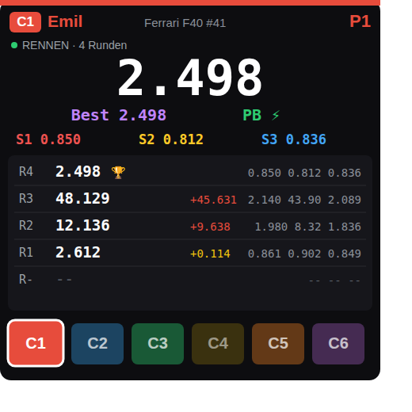

# SmartRace ESP32 Display

Ein physisches Renn-Display für das SmartRace LiveDashboard:
**ESP32-S3-Touch-LCD-4** (Waveshare) zeigt die Live-Rundenzeiten eines
Controllers, die letzten 10 Runden mit Sektoren, Bestzeit + Delta und Position.
Unten ein fester Touch-Picker **C1–C6**.

**Board (laut Waveshare-Wiki):** ESP32-S3-N16R8 (16 MB Flash, 8 MB PSRAM),
4″ IPS **480×480**, Display-Treiber **ST7701** (RGB), Touch **GT911** (I²C) +
IO-Expander. Frameworks: **Arduino IDE** und ESP-IDF; LVGL-Demo nutzt **LVGL 8.4**.

Das Display holt seine Daten per WLAN vom Dashboard-Server — es enthält **keine
Logik**, nur Anzeige.

```
SmartRace-App ─► Flask-Dashboard (z.B. 192.168.1.90:5000) ─WLAN─► ESP32 Display
```

## Layout (Vorschau)

Maßstabsgetreues Mockup (480×480), Beispiel: Controller **C1** ausgewählt — die
Kopfzeile (Farbleiste, C#-Badge, Fahrername, Position) färbt sich in der
Controllerfarbe.



## Verwendete Server-Endpunkte (schon im Dashboard vorhanden)

- `GET /api/device/laps?controller=N` — Fahrer, Best-/Letzte-Zeit, Position,
  Status, letzte 10 Runden + Sektoren (alles kompakt formatiert).
- `GET /api/device/controllers` — C1–C6 mit Fahrername/aktiv (für die Buttons).

Test vom PC aus:
```bash
curl "http://192.168.1.90:5000/api/device/laps?controller=1"
curl "http://192.168.1.90:5000/api/device/controllers"
```

## Voraussetzungen (Arduino IDE)

1. **Arduino IDE** (2.x) + **ESP32-Boardpaket** (Boards-Manager-URL von Espressif).
2. Board: *ESP32S3 Dev Module*, **PSRAM aktivieren** (OPI, wie im Wiki),
   16 MB Flash, passende Partition. Genaue Werte stehen im Waveshare-Wiki.
3. **Bibliotheken** (siehe Tabelle unten). Wichtig: **nicht** alle liegen im
   Bibliotheksverwalter — die board-spezifischen kommen aus dem Waveshare-Repo.
4. ESP32-Core: **Arduino-ESP32 `3.3.11`** (von Waveshare offiziell getestet) —
   **kein** `4.0.0-alpha*`! Die Alpha-Cores brechen die RGB-Panel-Lib
   (`gpio_num_t` / `bits_per_pixel`-Fehler). Umstellen im **Boardverwalter**:
   Eintrag „esp32 by Espressif" → Versions-Dropdown → `3.3.11` → Installieren.
   Board-Einstellungen: *ESP32S3 Dev Module*, **USB CDC On Boot: Enabled**,
   **Flash 16MB**, **PSRAM: OPI PSRAM**, Partition **16M Flash (3MB APP/9.9MB FATFS)**.

### Benötigte Bibliotheken

Der Display-/Touch-Teil läuft über **ESP32_Display_Panel** — die nutzt einen
**Doppel-/Triple-Framebuffer (Anti-Tear)** und behebt so das Flackern, das mit
Arduino_GFX (nur ein Framebuffer) bei aktivem WLAN nicht lösbar war.

| Bibliothek | Version | Woher | Zweck |
|---|---|---|---|
| **ESP32_Display_Panel** | **1.0.5+** | [Bibliotheksverwalter](https://github.com/esp-arduino-libs/ESP32_Display_Panel) | Display (ST7701 RGB), Anti-Tear |
| **lvgl** | **8.4.0** (nicht 9.x!) | Bibliotheksverwalter · [Upstream](https://github.com/lvgl/lvgl) | GUI-Framework |
| **lv_conf.h** | zu 8.4.0 passend | [Waveshare-Repo](https://github.com/waveshareteam/ESP32-S3-Touch-LCD-4/blob/main/examples/arduino/libraries/lv_conf.h) | LVGL-Konfig (Farbtiefe 16, alle Montserrat-Fonts an) — **direkt in `libraries/` legen**, neben den `lvgl`-Ordner |
| **SensorLib** | Waveshare-Stand | [Waveshare-Repo](https://github.com/waveshareteam/ESP32-S3-Touch-LCD-4/tree/main/examples/arduino/libraries/SensorLib) · [Upstream](https://github.com/lewisxhe/SensorLib) | Touch (GT911, über Arduino-Wire) |
| **WS_CH32_IO** | Waveshare-only | **nur** [Waveshare-Repo](https://github.com/waveshareteam/ESP32-S3-Touch-LCD-4/tree/main/examples/arduino/libraries/WS_CH32_IO) | IO-Expander (Display-Reset/Backlight) |
| **ArduinoJson** | **7.x** | [Bibliotheksverwalter](https://arduinojson.org/) | JSON-Parsing der API |

> **ESP32_Display_Panel** über den Bibliotheksverwalter installieren (Suche
> „ESP32_Display_Panel") — sie macht **nur das Display**. Den **GT911-Touch** treibt
> der Sketch selbst über **`SensorLib`** + Arduino-Wire, weil GT911 und der
> **`WS_CH32_IO`**-Expander am selben I2C-Bus hängen (sonst I2C-Treiberkonflikt
> „driver_ng … old driver"). `SensorLib` und `WS_CH32_IO` kommen als ZIP über
> *Sketch → Bibliothek einbinden → .ZIP-Bibliothek hinzufügen…*.
> `GFX_Library_for_Arduino` wird **nicht mehr** gebraucht.

### Display wird direkt im Sketch aufgebaut (keine Board-Config-Dateien)

Das Display (RGB-Bus + ST7701) wird **direkt in `smartrace_display.ino`** über die
Treiberklassen `BusRGB`/`LCD_ST7701` konstruiert — **ohne** die Board-Config-Dateien
und **ohne** die `Board`-Klasse von ESP32_Display_Panel. Grund: Deren Auto-Config
(`esp_panel_board_default_config.cpp`) findet im Arduino-Build die Config-Dateien im
Sketch-Ordner **nicht zuverlässig** und fiel auf einen Default **mit Touch** zurück
→ zweiter I2C-Treiber → Absturz (`i2c: CONFLICT ... driver_ng`). Manuell konstruiert
nutzt ESP_PANEL für's Display **kein** I2C. Der GT911-Touch läuft über Arduino-Wire.

Diese Dateien gehören in den Sketch-Ordner (kommen über `git`/ZIP mit):

| Datei | Zweck |
|---|---|
| `smartrace_display.ino` | Sketch inkl. Pins/Timings/ST7701-Init (fest im Code) |
| `lvgl_v8_port.h/.cpp` | LVGL-Anbindung mit **`LVGL_PORT_AVOID_TEARING_MODE = 3`** (Doppel-FB + Direct-Mode) |
| `esp_panel_drivers_conf.h`, `esp_utils_conf.h` | ESP32_Display_Panel-Konfig (aktiviert u.a. den ST7701-Treiber) |

## Einrichtung

### 1) Libs installieren
`ESP32_Display_Panel` (1.0.5+), `lvgl` (8.4.0), `ArduinoJson` (7.x) über den
Bibliotheksverwalter; `WS_CH32_IO` als ZIP; `lv_conf.h` in `libraries/` legen.
Danach IDE einmal neu starten.

### 2) Board-Einstellungen
Wie oben: *ESP32S3 Dev Module*, Core **3.3.11**, **USB CDC On Boot: Enabled**,
**Flash 16MB**, **PSRAM: OPI PSRAM**, Partition **16M Flash (3MB APP/9.9MB FATFS)**.

### 3) Sketch öffnen & konfigurieren
- **Alle** Dateien des `smartrace_display/`-Ordners gehören zusammen in **einen**
  Sketch-Ordner (die `.ino` + `config.h` + die 5 `esp_panel*`/`lvgl_v8_port`-Dateien).
- In **`config.h`** eintragen: `WIFI_SSID`, `WIFI_PASSWORD`, `SERVER_BASE`
  (z.B. `http://192.168.1.90:5000`).
- Display-Details musst du **nicht** anfassen — sie stehen in
  `esp_panel_board_custom_conf.h` (Pins/ST7701-Init aus `09_LVGL_Widgets`).

> ⚠️ **WICHTIG — nach dem Umstieg einmal den Build-Cache leeren.** Arduino baut die
> Library-Objekte (`.o`) nur neu, wenn sich Library-Quellen ändern — bei reinen
> Sketch-Änderungen bleibt das **alte, evtl. mit Touch kompilierte Objekt** im Cache.
> Symptom: identischer Absturz trotz Änderungen. Fix: Arduino IDE schließen, unter
> Windows den Ordner `%LOCALAPPDATA%\Temp\arduino\` löschen (nur Cache), neu bauen.
>
> Falls beim Kompilieren `undefined reference to LCD_ST7701` kommt: dann findet die
> Library die `esp_panel_drivers_conf.h` nicht → zusätzlich nach
> `Dokumente/Arduino/libraries/` kopieren (in den `libraries/`-Ordner selbst, neben —
> nicht in — den `ESP32_Display_Panel`-Ordner) und erneut sauber bauen.

### 3) Flashen
Kompilieren und hochladen. Auf dem Serial-Monitor (115200) siehst du den
WLAN-Status. Das Display verbindet sich, holt alle 0,5 s die Daten und zeigt
den gewählten Controller. Unten C1–C6 antippen zum Wechseln.

## Was der Sketch macht (Überblick)

| Bereich | Funktion |
|---|---|
| WLAN | `wifi_connect()` — verbindet, reconnectet bei Aussetzern |
| Daten | `fetch_laps()` — HTTP GET + ArduinoJson, aktualisiert die Labels |
| Buttons | `fetch_controllers()` — deaktiviert Buttons ohne Daten (optional) |
| UI | `build_ui()` — Labels, Sektoren, Runden-Liste, C1–C6-Buttonmatrix |
| Loop | `lv_timer_handler()` + Polling im Intervall |

Farben sind auf das Web-Dashboard abgestimmt (C1 rot … C6 lila; S1 rot, S2 gelb,
S3 blau).

**Auf einen Blick:** die Farbe des gewählten Controllers wird als Akzent an
mehreren Stellen gezeigt — obere Farbleiste, „C#"-Badge, Fahrername und Position.
Im Picker ist der aktive Button voll deckend + weißer Rand, die anderen sind
abgedunkelt (Buttons ohne Daten noch etwas mehr).

## Anpassen

- **Intervall**: `POLL_INTERVAL_MS` in `config.h` (Default 500 ms).
- **Anzahl Runden in der Liste**: `LAP_LIST_COUNT` (max 10, so viele liefert die API).
- **Schriftgrößen/Layout**: in `build_ui()` (LVGL-Fonts müssen in `lv_conf.h`
  aktiviert sein — z.B. `montserrat_48` für die große Zeit).

## Flackern beheben

Das Flackern kam daher, dass Arduino_GFX **nur einen** Framebuffer hat: dasselbe
PSRAM wird gleichzeitig zum Bildschirm geschoben **und** von LVGL neu beschrieben.
Mit aktivem WLAN reißt die PSRAM-Bandbreite → sichtbares Flackern. **ESP32_Display_Panel**
löst das über **mehrere Framebuffer (Anti-Tear)**: LVGL schreibt in einen, angezeigt
wird ein anderer. Deshalb ist der Umbau die eigentliche Lösung.

Stellschrauben (falls doch noch Reste bleiben):

- **Anti-Tear-Modus** in `lvgl_v8_port.h` → `LVGL_PORT_AVOID_TEARING_MODE`
  (Default **3** = Doppel-FB + Direct-Mode). Bei Rest-Tearing **`2`** probieren
  (Triple-FB + Full-Refresh, am ruhigsten, braucht 1 FB mehr PSRAM ≈ 460 KB).
- **`ESP_PANEL_BOARD_LCD_RGB_CLK_HZ`** in `esp_panel_board_custom_conf.h`
  (Default **14 MHz**). Bei Screen-Drift/Zittern eher **senken** (12–13 MHz).
- **Bounce-Buffer**: im Sketch auf `WIDTH * 10` gesetzt (`board_init()`), bzw.
  `ESP_PANEL_BOARD_LCD_RGB_BOUNCE_BUF_SIZE` in der Board-Config. Bei Drift größer,
  bei zu großem Wert (Alloc schlägt fehl) kleiner.
- **WLAN-Modem-Sleep aus** (`WiFi.setSleep(false)`, bereits gesetzt).

> Wenn nach dem Umbau **das Display schwarz bleibt** oder **Touch nicht geht**,
> liegt es fast immer an der Board-Config (`esp_panel_board_custom_conf.h`) oder
> am geteilten I2C-Bus (CH32 ↔ GT911). Melde dich mit der **Serial-Ausgabe (115200)**
> — daran sieht man, ob `Board().init()`/`begin()` durchläuft.

## Hinweise

- Diese Firmware nutzt **REST-Polling** (robust auf dem ESP32) statt der
  Web-WebSockets. 0,5 s Intervall ist für ein Display flüssig genug und schont
  das WLAN.
- LVGL-**Version**: der Sketch ist für **LVGL 8.x** geschrieben und passt damit
  zum Waveshare-Beispiel (**LVGL 8.4**) — keine API-Portierung nötig.
- Getestet werden konnte hier nur der **Server-Teil** (die Endpunkte). Den
  Firmware-Teil bitte auf der echten Hardware verifizieren — melde dich, wenn
  beim Kompilieren/Anzeigen etwas hakt, dann passen wir es an.
